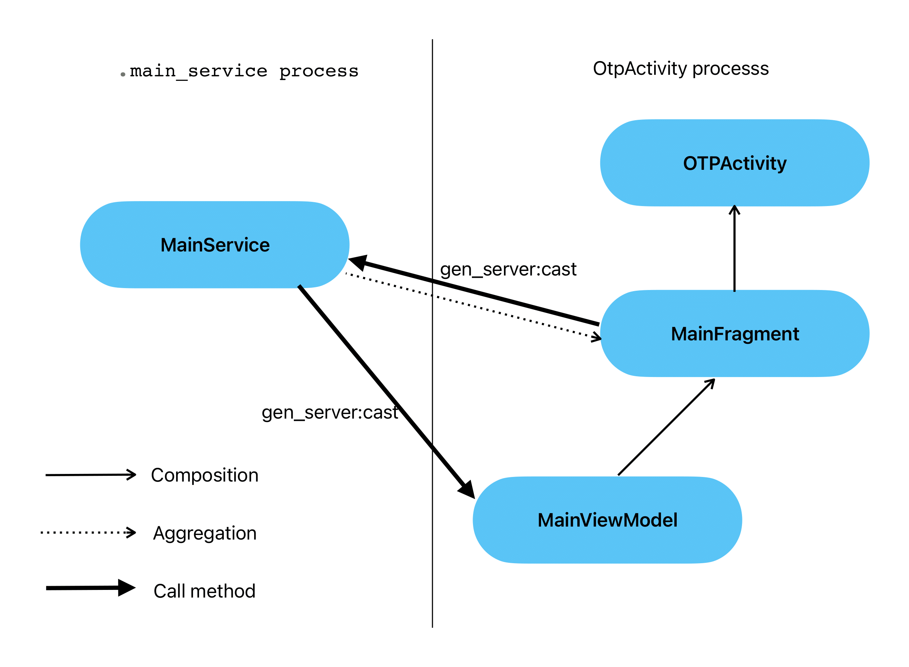

# AndroidOTP

## Introduction
The main objective of this project is to provide an illustration of how the application structure 
can look if we incorporate certain concepts from Erlang/OTP into standard code interactions.
The goal is to demonstrate how code interaction can be organized in different threads, processes, 
and application components using Erlang/OTP concepts. This project aims to explore applicable 
techniques or features from Erlang/OTP programming in Android to transform the code into a more 
functional form.

## Project Structure
The project is organized into multiple modules, each serving a specific purpose:
* android - implementation module, which explores the Erlang/OTP concept based on Android's 
Handler/Looper
* app/example - example module, demonstrating code examples using the aforementioned concepts
* otp - core module, serving as the foundation for the entire project, describing the conceptual 
framework 
** kotlin - implementation module, evolving the Erlang/OTP concept using Kotlin coroutines (this 
module is currently in the planning stage)

## How the example module is structured
To understand the application structure, let's examine its simplified form depicted in Figure 1.

In this diagram, there are two processes: **.main_service** and the main thread running under 
OTPActivity. Blue shapes represent gen_server instances that correspond to the declared classes.
Bold black arrows indicate the direction of message passing between gen_server instances. As 
depicted in the diagram, the message passing between gen_servers is not dependent on the specific 
instantiation method or ownership of the class instance. A unified approach is used for
communication between gen_servers. In Figure 1, MainService directly sends data to MainViewModel 
without the mediator of MainFragment.

## What are the advantages of this concept?
When scaling this system to 3 or more interconnected node gen_server processes (applications), the
method of communication remains unified. The communication method involves passing two arguments:
the name of the recipient and the message itself. Thus, there is no need to pass messages between
mediators, such as between a server in one process and a view model in another. Furthermore, 
the gen_server interface (behavior) implies storing states in a suspended function that awaits a
message. Such behavior can be implemented in Kotlin coroutines, but for Handler/Looper, either 
variables stored within the gen_server instance or stopping the thread until it is awakened by some 
event need to be used.

## Unresolved Questions
Currently, the project is still in development and there are the following discussion points:
1) How should the supervisor behave towards the main components if the Android system itself manages
the lifecycle of the components?
2) Should an instance of GenServerUtil be created within an instance of GenServer, or should it be
similar to gen_server in Erlang/OTP, where the gen_server instance is created through the function
calls gen_server:start or gen_server:start_link, as it is currently implemented?
3) What storage mechanism should be used for communication between remote instances of GenServer 
(i.e., instances located in different processes)? Currently, each process has its own listServices,
which contains a set of GenServer instances. To invoke a remote GenServer, whose name is not
included in the local listServices, the call is forwarded to a node-level GenServer, which is 
located in a different process but has a reference in the local listServices. The node-level
GenServer then searches for the specified GenServer in its memory and, if not found, continues the 
search and forwards the message to other node-level GenServers. The option of using a 
ContentProvider as a storage for living processes is not considered due to additional 
platform-related complexities.

# AndroidOTP

## Введение
Основная задача данного проекта это дать представление того, как может выглядеть структура 
приложений, если внедрить в стандартные способы взаимодействия кода некоторые концепции из 
Erlang/OTP. Создать представление того, как могло бы быть выстроено взаимодействие кода в разных 
потоках, на разных процессах, в разных компонентах приложения с использованием концепций Erlang/OTP. 
Посмотреть, какие можно применить приемы или особенности программированя из Erlang/OTP под Android
для преобразования кода к более функциональному виду.

## Структура проекта
Проект разбит на несколько модулей, каждый из которых делает следующее:
* android - модуль реализация, содержит в себе развитие концепции Erlang/OTP на базе Handler/Looper
от Android
* app/example - модуль пример, показывает пример кода с использованием приведенных концепций
* otp - модуль ядро, то на чем основан весь проект, описывает то как должна выглядеть концепция
** kotlin - модуль реализация, содержит в себе развитие концепции Erlang/OTP на базе корутин Kotlin
   (модуль на стадии планирования)

## Как устроен модуль примера
Для понимания структуры приложения, рассмотрим его простую форму, представленную на Рисунке 1.

На этом рисунке представлено два процесса **.main_service** и главный поток, под которым запущен
OTPActivity. Синими фигурами обозначены экземпляры gen_server, которые соответствуют объявленным 
классам. Черными крупными стрелками обозначено направление передачи сообщения от одного gen_server
к другому gen_server экземпляру. Как видно на схеме, передача сообщения от одного gen_server к 
другому не зависит от того, каким способом создался тот или иной экземпляр класса и кто его держит.
При этом используется единый способ общения между gen_server. На рисунке 1 MainService отправляет
MainViewModel данные напрямую, без посредника MainFragment.

## Какие преимущества предоставляет такая концепция
При масштабировании этой системы до 3-х и более процессов (приложений), связанных между собой 
узловыми gen_server (о которых будет сказано ниже), способ общения остается единым. Способ, 
посредством которого происходит общение, заключается в передаче двух аргументов - имя того, кому 
передается сообщение, и само сообщение. Таким образом, для передачи сообщения не нужно 
перекидываться между посредниками, как например между сервером в одном процессе и view model в 
другом. Помимо этого, интерфейс (поведение) gen_server подразумевает хранение состояний в 
приостановленной функции, ждущей сообщение. Такое поведение реализуемо в kotlin coroutines, но для 
Handler/Looper нужно пользоваться либо переменными, которые храняться внутри экземпляра gen_server,
либо останавливать поток, пока его что-нибудь не пробудет.

## Нерешенные вопросы
На данный момент проект находится в разработке и имеются следующие дискуссионные вопросы:
1) Каким образом должен вести себя supervisor в отношении основных компонентов, если жизненным 
циклом компонентов Android следит сама система?
2) Должен ли создаваться экземпляр GenServerUtil внутри экземпляра GenServer или же должно быть
наподобие gen_server в Erlang/OTP, когда создание экземпляра gen_server происходит через вызов
функций gen_server:start или gen_server:start_link, как это сделано на данный момент?
3) Посредством какого хранилища для живущих экземпляров GenServer должно происходить общение между 
удаленными экземплярами GenServer (тоесть которые находятся в разных процессах)? На данный момент
в каждом процессе содержится свой список listServices, который имеет свой набор GenServer. Для
вызова удаленного GenServer, имя которого не содержится в локальном listServices, вызов передается
узловому GenServer, который находится в другом процессе, но содержится ссылка в локальном 
listServices. Узловой GenServer в свою очередь ищет в своей области памяти указанный в сообщении
GenServer, и если не нашел, то поиск продолжается и сообщение передается другим узловым GenServer.
Вариант с ContentProvider в качестве хранилища живущих процессов не рассматривается, поскольку 
несет с собой дополнительные сложности связанные с платформой.